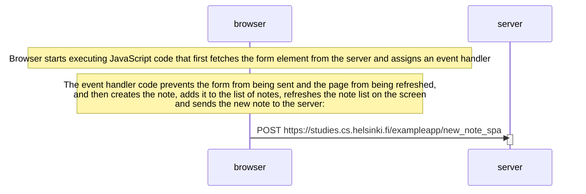

```mermaid
sequenceDiagram
participant browser
participant server

Note over browser: Browser starts executing JavaScript code that first fetches the form element from the server and assigns an event handler
Note over browser: The event handler code prevents the form from being sent and the page from being refreshed, <br/> and then creates the note, adds it to the list of notes, refreshes the note list on the screen <br/> and sends the new note to the server:

browser->>server: POST https://studies.cs.helsinki.fi/exampleapp/new_note_spa
activate server
deactivate server
```